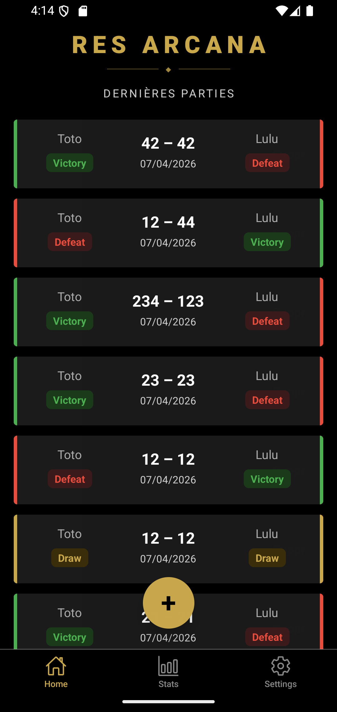
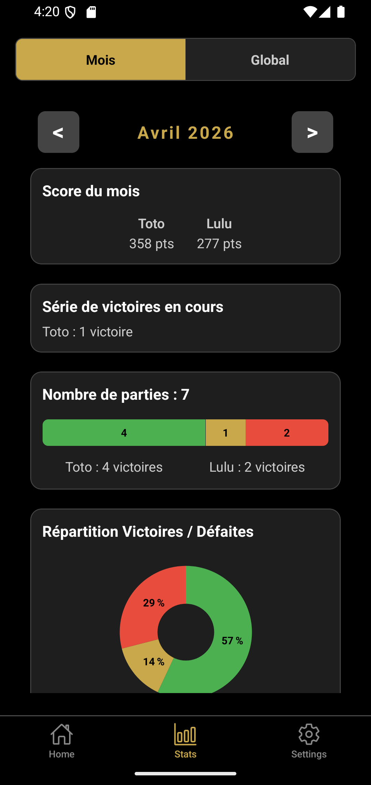
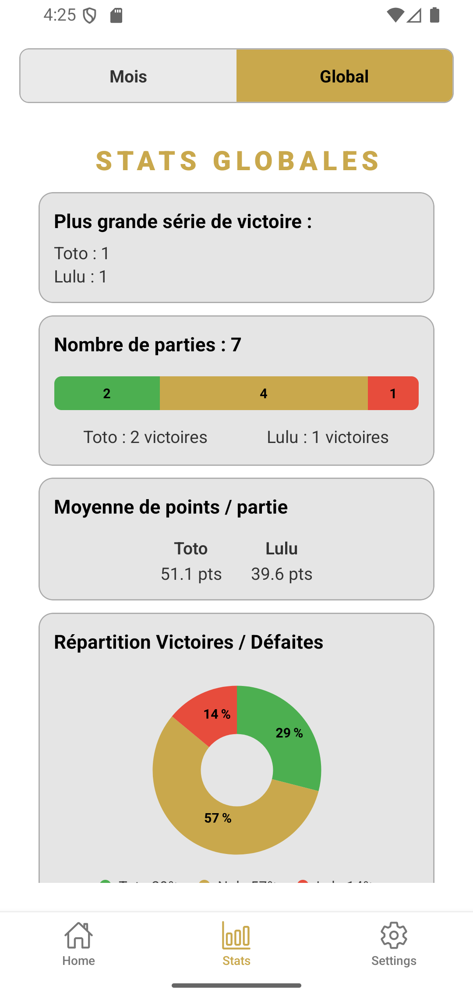
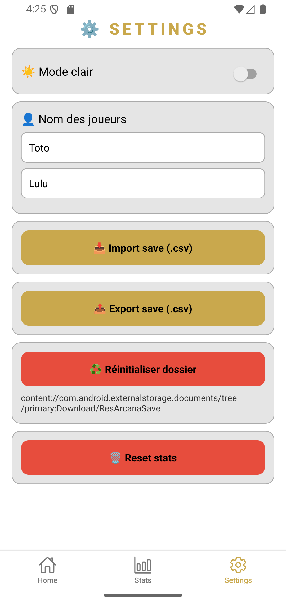

# 🎴 Res Arcana Tracker

Application mobile de suivi de scores pour le jeu de cartes **Res Arcana**, développée avec Expo / React Native.

---

## 📱 Fonctionnalités

- Enregistrement des parties (scores, date, victoire/défaite/égalité)
- Historique des 20 dernières parties avec swipe pour éditer ou supprimer
- Statistiques mensuelles et globales (win rate, séries de victoires, moyenne de points...)
- Noms des joueurs personnalisables
- Thème clair / sombre
- Import / Export des données en CSV

---

## 📸 Screenshots

<p float="left">
  
  
  
  
</p>

## ⚙️ Prérequis

Avant de commencer, assure-toi d'avoir installé :

- [Node.js](https://nodejs.org/) (v18 ou supérieur recommandé)
- [pnpm](https://pnpm.io/) — gestionnaire de paquets utilisé dans ce projet

```bash
  npm install -g pnpm
```

- [Android Studio](https://developer.android.com/studio) avec un émulateur configuré **ou** l'app **Expo Go** sur ton téléphone
- **Extension VSCode** : [Android iOS Emulator](https://marketplace.visualstudio.com/items?itemName=DiemasMichiels.emulate) — pour lancer l'émulateur sans ouvrir Android Studio

---

## 🚀 Lancer l'application

### 1. Installer les dépendances

```bash
pnpm install
```

### 2. Lancer l'émulateur depuis VSCode

Pour éviter d'ouvrir Android Studio au quotidien, utilise l'extension VSCode **Android iOS Emulator** (DiemasMichiels.emulate).

**Configuration (une seule fois) :**

- Ouvre les settings VSCode (`Ctrl+,`)
- Cherche **"Android iOS Emulator"**
- Dans **Emulator Path Windows**, mets :

```
  C:\Users\TON_NOM_UTILISATEUR\AppData\Local\Android\Sdk\emulator
```

⚠️ Sans le `\emulator.exe` à la fin !

**Workflow quotidien :**

1. **Ctrl+Alt+E** — lance l'émulateur depuis VSCode
2. Attends que l'émulateur soit **complètement booté** (écran Android visible)
3. Lance `pnpm dev:android` dans le terminal

> Android Studio doit rester installé pour gérer les virtual devices (AVD Manager), mais plus besoin de l'ouvrir au quotidien.

### 3. Commandes de lancement

#### Sur émulateur Android

```bash
pnpm dev:android
```

#### Sur ton téléphone physique

```bash
pnpm dev:android
```

Scanne le QR code avec l'app **Expo Go** sur ton téléphone.

#### Sur émulateur iOS (Mac uniquement)

```bash
pnpm ios
```

#### En mode web (limité, non recommandé)

```bash
pnpm web
```

> ⚠️ Si tu viens d'installer une nouvelle dépendance avec du code natif, utilise `pnpm android` à la place de `pnpm dev:android` pour recompiler.

---

## 📁 Structure du projet

```
src/
├── components/         # Composants réutilisables (ScreenContainer, PieChart, ConfirmModal...)
├── db/                 # Configuration WatermelonDB (database, migrations, schema)
├── models/             # Modèles WatermelonDB (GameModel)
├── navigation/         # Navigation (MainNavigation, types)
├── screens/            # Écrans de l'app
│   ├── HomeScreen.tsx          # Accueil — liste des parties
│   ├── AddGameScreen.tsx       # Ajouter une partie
│   ├── EditGameScreen.tsx      # Modifier une partie
│   ├── StatsScreen.tsx         # Conteneur stats (onglets Mois / Global)
│   ├── GlobalStats.tsx         # Stats globales
│   ├── MonthlyStats.tsx        # Stats mensuelles
│   └── SettingsScreen.tsx      # Paramètres (joueurs, thème, import/export)
├── stores/             # Stores Zustand
│   ├── gameStore.ts            # Gestion des parties
│   ├── playerStore.ts          # Noms des joueurs (AsyncStorage)
│   └── themeStore.ts           # Thème clair/sombre (AsyncStorage)
├── styles/             # Styles centralisés
│   └── useAppStyles.ts         # Hook de styles global (thème clair/sombre)
└── utils/              # Fonctions utilitaires
    ├── statsHelpers.ts         # Calculs statistiques
    ├── exportGamesToCSV.ts     # Export CSV
    ├── importGamesFromCSV.ts   # Import CSV
    ├── gameFilters.ts          # Filtres sur les parties
    ├── formatDate.ts           # Formatage des dates
    └── safStorage.ts           # Wrapper AsyncStorage
```

---

## 🗃️ Base de données

L'app utilise **WatermelonDB** (SQLite sous le capot) pour stocker les parties en local sur le téléphone. Les données persistent entre les sessions sans connexion internet.

Les noms des joueurs et le thème sont stockés séparément via **AsyncStorage**.

---

## 🔧 Stack technique

| Technologie                    | Usage                                 |
| ------------------------------ | ------------------------------------- |
| React Native 0.79              | Framework mobile                      |
| Expo SDK 53                    | Toolchain & build                     |
| WatermelonDB 0.28              | Base de données locale                |
| Zustand 5                      | State management                      |
| React Navigation 7             | Navigation (tabs + stack)             |
| date-fns                       | Formatage des dates                   |
| AsyncStorage                   | Persistance légère (thème, joueurs)   |
| react-native-svg               | Graphiques (camembert stats)          |
| expo-splash-screen             | Splash screen                         |
| react-native-swipe-list-view   | Swipe éditer/supprimer sur les cartes |
| expo-file-system               | Lecture/écriture fichiers CSV         |
| @expo/vector-icons             | Icônes de la tab bar                  |
| expo-dev-client                | Client de développement               |
| react-native-gesture-handler   | Gestion des gestes tactiles           |
| react-native-safe-area-context | Gestion des zones sûres (notch etc.)  |

---

## 📦 Build de production (EAS)

Le projet est configuré avec **EAS Build** (Expo Application Services).

```bash
# Installer EAS CLI si pas déjà fait
npm install -g eas-cli

# APK directement installable sur téléphone (recommandé pour usage perso)
eas build --platform android --profile preview

# Build Android (.aab — pour le Play Store uniquement)
eas build --platform android

# Build iOS (nécessite un compte Apple Developer)
eas build --platform ios
```

> Le `projectId` EAS est déjà configuré dans `app.json`.

> 💡 Projet visible sur [expo.dev](https://expo.dev/accounts/toto3529/projects/appli-res-arcana)

> 💡 Pour installer l'APK sur ton téléphone : télécharge le fichier `.apk` généré par EAS et envoie-le sur ton téléphone via câble USB ou Google Drive. Active **"Sources inconnues"** dans les paramètres Android si nécessaire.

---

## 🐛 Problèmes fréquents

**Metro bundler qui plante au démarrage**

```bash
pnpm start --clear
```

**Erreur de dépendances après un `git pull`**

```bash
pnpm install
```

**Après avoir ajouté une dépendance avec pnpm**

> Le build EAS nécessite un `package-lock.json` synchronisé. Après chaque `pnpm install`, regénère-le avec :
>
> ```bash
> npm install --legacy-peer-deps
> ```

**L'émulateur plante au lancement depuis VSCode**

> Attends que l'émulateur soit complètement booté avant de lancer `pnpm dev:android`.

**Nouvelle dépendance installée mais l'app ne démarre pas**

> Si tu viens d'installer une lib avec du code natif, utilise `pnpm android` pour recompiler.

**La base de données semble vide après une mise à jour**

> Les migrations WatermelonDB sont dans `src/db/migrations.ts`. Si tu as modifié le schéma sans ajouter de migration, désinstalle l'app du téléphone et réinstalle-la.

---

## 👤 Auteur

Projet personnel — Antoine  
Package : `com.antoine.appliresarcana`  
Stack : React Native / Expo / TypeScript
